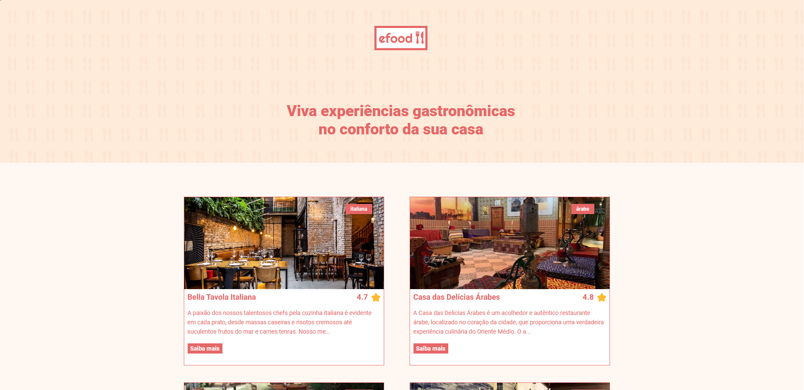

  

<h1 align="center">EFOOD - Seu site de pedidos deliciosos!🍴</h1>

<h1 align="center">
    <a href="https://efood-blue.vercel.app">🔗 Clique aqui para acesar o  site da EFOOD</a>
</h1>

🚀 Loja virtual de restaurantes feitas por mim para teste final do curso de Front-end da EBAC.

Tabela de conteúdos
=================

 <a href="#-objetivo">Objetivo</a> •
 <a href="#-tecnologias">Tecnologias</a> • 
 <a href="#features">Features</a> • 
 <a href="https://github.com/StaanB/EPLAY/blob/main/LICENSE">Licença</a> • 
 <a href="#autor">Autor</a>

<h4 align="center"> 
	✅ EFOOD 🚀 Projeto finalizado.  ✅
</h4>

### ✅ Objetivo

💡A ideia principal era um site para acesso de clientes, com requisições ao back end (feita por API nesse caso) e com simulação de pagamento e várias outras funcionalidades como carrinho, páginas para cada restaurante e entre outras coisas. Foi feito como conclusão para o curso de Front-end da EBAC.

### 💻 Tecnologias

<h2>Lista de tecnologias utilizadas nesse projeto: </h2>

• ReactJS

• Typescript

• Styled-Components

• Prettier

• React Router

• Formix

• Eslint

• API

• Redux Toolkit

• React Spinners

### 💡Features

- [x] Escolha de produto.
- [x] Utilização do carrinho.
- [x] Verificação de formulário.
- [x] Integração com API.
- [x] Finalização e compra do produto.

<h3><a href="https://github.com/StaanB/EFOOD/blob/main/LICENSE">⚖️LICENÇA</a></h3>

### 🧑🏻Autor
---

<a href="https://github.com/StaanB">
 
  
 <b>Stanley Brenner</b></a> <a href="https://stanley-b.vercel.app/" title="Stanley">🚀</a>

Feito por Stanley 👋🏽 Entre em contato!

 

